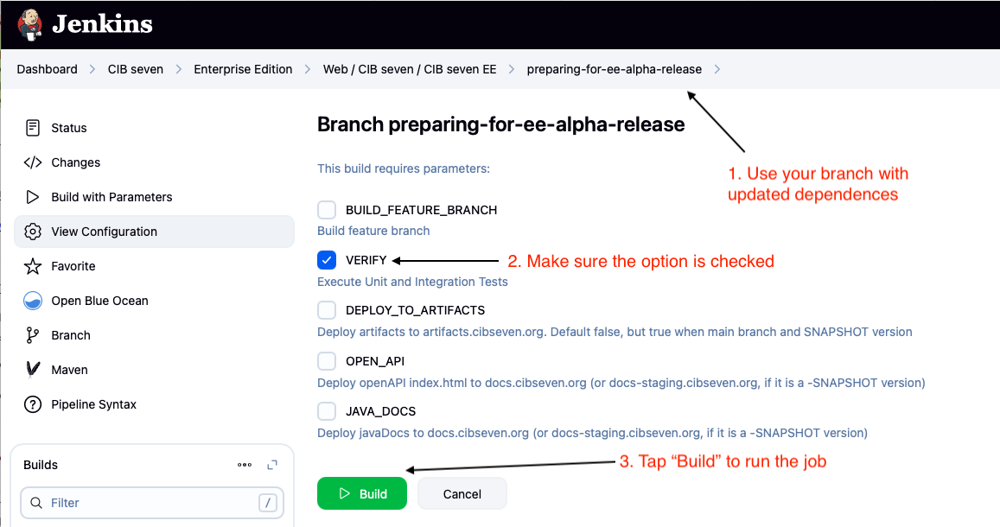
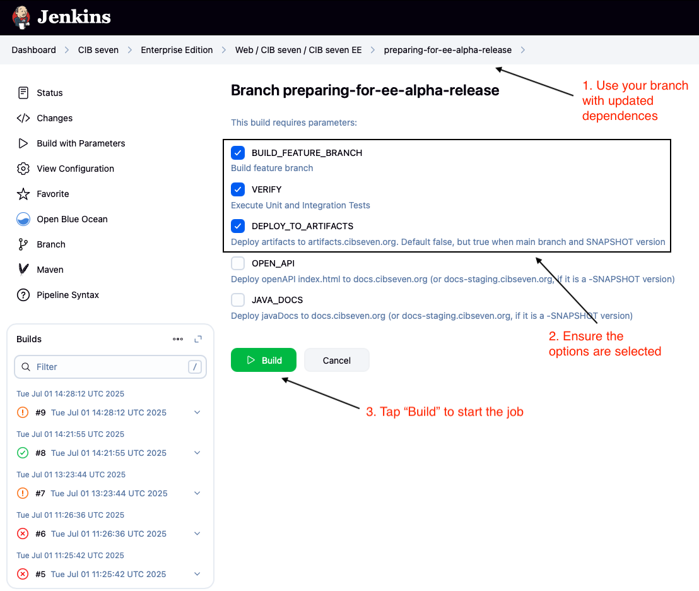

# CIB seven - The open source BPMN platform

[](https://docs.cibseven.org/manual/latest/) [](https://github.com/cibseven/cibseven/blob/master/LICENSE) [](https://github.com/orgs/cibseven/discussions)

CIB seven is a flexible framework for workflow and process automation. Its core is a native BPMN 2.0 process engine that runs inside the Java Virtual Machine. It can be embedded inside any Java application and any Runtime Container. It integrates with Java EE 6 and is a perfect match for the Spring Framework. On top of the process engine, you can choose from a stack of tools for human workflow management, operations and monitoring.

- Web Site: https://cibseven.org
- Getting Started: https://docs.cibseven.org/get-started/
- Discussions: https://github.com/orgs/cibseven/discussions
- Issue Tracker: https://github.com/cibseven/cibseven/issues

## Components

CIB seven provides a rich set of components centered around the BPM lifecycle.

#### Process Implementation and Execution

- Engine - The core component responsible for executing BPMN 2.0 processes.
- REST API - The REST API provides remote access to running processes.
- Spring, CDI Integration - Programming model integration that allows developers to write Java Applications that interact with running processes.

#### Process Design

- Camunda Modeler - A [standalone desktop application](https://github.com/camunda/camunda-modeler) that allows business users and developers to design & configure processes.

#### Process Operations

- Engine - JMX and advanced Runtime Container Integration for process engine monitoring.
- Cockpit - Web application tool for process operations.
- Admin - Web application for managing users, groups, and their access permissions.

#### Human Task Management

- Tasklist - Web application for managing and completing user tasks in the context of processes.

#### And there's more...

- [bpmn.io](https://bpmn.io/) - Toolkits for BPMN, CMMN, and DMN in JavaScript (rendering, modeling)
- [Community Extensions](https://docs.cibseven.org/manual/latest/introduction/extensions/) - Extensions on top of CIB seven provided and maintained by our great open source community

## A Framework

In contrast to other vendor BPM platforms, CIB seven strives to be highly integrable and embeddable. We seek to deliver a great experience to developers that want to use BPM technology in their projects.

### Highly Integrable

Out of the box, CIB seven provides infrastructure-level integration with Java EE Application Servers and Servlet Containers.

### Embeddable

Most of the components that make up the platform can even be completely embedded inside an application. For instance, you can add the process engine and the REST API as a library to your application and assemble your custom BPM platform configuration.

## Contributing

Please see our [contribution guidelines](CONTRIBUTING.md) for how to raise issues and how to contribute code to our project.

## Tests

To run the tests in this repository, please see our [testing tips and tricks](TESTING.md).


## License

The source files in this repository are made available under the [Apache License Version 2.0](./LICENSE).

CIB seven uses and includes third-party dependencies published under various licenses. By downloading and using CIB seven artifacts, you agree to their terms and conditions. Refer to https://docs.cibseven.org/manual/latest/introduction/third-party-libraries/ for an overview of third-party libraries and particularly important third-party licenses we want to make you aware of.

## CIB seven Enterprise Edition - Release Procedure

The Enterprise Edition is based on CIB seven CE and Community+, so their stability is crucial for a successful EE release.

### Pre-Release Checklist

- **Verify [CIB seven CE](https://github.com/cibseven/cibseven)** is stable
   - Ensure that all tests are passing in Jenkins: https://jenkins.cib.de/job/cibseven/job/github_branches/job/main/

- **Verify [CIB seven Community+](https://gitlab.cib.de/web/cibseven/mirror-cibseven)** is functioning properly and stable
   - Build the project locally and verify that all distributions (tomcat, run, wildfly) are working as expected and all tests are passing
   - >**Important**: Ensure the following synchronization steps are completed:
      - Pull the latest changes from the upstream CIB seven CE repository into mirror-cibseven repository
      - When necessary, synchronize relevant changes from the upstream Camunda open-source repository: https://github.com/camunda/camunda-bpm-platform
      - Ensure CIB seven EE is synchronized with mirror-cibseven, as it is maintained as a GitLab fork.

### Prepare release - Build and Deploy Snapshots
1. **Merge Changes**: Ensure all required changes are merged into the protected `main` branch
2. **Create Release Branch**: Create a new branch for the release preparation (e.g., `preparing-for-ee-release`)
3. **Increment Version**: If necessary, increment the version number and ensure all module versions are aligned. You can use the following command to set the new snapshot version across multiple POM files:
   ```bash
   mvn versions:set -DnewVersion=2.0.1-ee-SNAPSHOT -DgenerateBackupPoms=false
   ```
4. **Update Dependencies:**
   - For each project, follow the appropriate **snapshot release procedure**:
      - [cibseven-release-parent-ee](https://gitlab.cib.de/web/cibseven/cibseven-release-parent-ee#release-procedure) *(optional, release only if there were changes)*
     - [cibseven-license-check](https://gitlab.cib.de/web/cibseven/cibseven-license-check#release-procedure) *(optional, release only if there were changes)*
     - [mirror-cibseven-webclient](https://gitlab.cib.de/web/cibseven/github-mirror/mirror-cibseven-webclient#release-procedure) *(ensure `bpm-sdk` and `cib-common-components` are updated to the latest versions from [npm-hosted](https://artifacts.cibseven.org/#browse/browse:npm-hosted))*
     - [cibseven-webclient-ee](https://gitlab.cib.de/web/cibseven/cibseven-webclient-ee#release-procedure) *(must be aligned with the target upcoming version, e.g. `2.0.2-alpha-ee-SNAPSHOT`, and match the version used for CIB seven EE; also ensure you have the latest snapshot versions of `cibseven-webclient-core` (from [enterprise-snapshot](https://artifacts.cibseven.org/#browse/browse:enterprise-snapshots:org%2Fcibseven%2Fwebapp%2Fcibseven-webclient-core)) and `cibseven-components` (from [npm-hosted](https://artifacts.cibseven.org/#browse/browse:npm-hosted:cib-common-components)))*

   - Ensure that the `<artifactId>release-parent-ee</artifactId>` dependency is updated to the latest available version (from [enterprise-snapshot](https://artifacts.cibseven.org/#browse/browse:enterprise-snapshots:org%2Fcibseven%2Frelease-parent-ee)) in all relevant POM files.
   - Update the `cibseven-webapp.version` property to the latest snapshot version (from [enterprise-snapshot](https://artifacts.cibseven.org/#browse/browse:enterprise-snapshots:org%2Fcibseven%2Fwebapp%2Fcibseven-webclient-web-ee)) in the root `pom.xml`.
   
5. **Verify Build and Tests**:
   - Execute automated tests and confirm all tests pass by running the CI/CD job for your branch: https://jenkins.cib.de/job/cibseven/job/enterprise-edition/job/cibseven-ee
       
       

   - Build the project locally and verify that all distributions (tomcat, run, wildfly) are working as expected
6. **Trigger Snapshot Build**: Execute the `DEPLOY_TO_ARTIFACTS` job with parameters on the branch: https://jenkins.cib.de/job/cibseven/job/enterprise-edition/job/cibseven-ee

      

7. **Verify Snapshot Deployment**: Confirm that the snapshots have been successfully deployed to the [enterprise-snapshots repository](https://artifacts.cibseven.org/#browse/browse:enterprise-snapshots)
8. **Validate Snapshot Artifacts**: Test the deployed snapshot artifacts using the [cibseven-get-started-spring-boot](https://github.com/cibseven/cibseven-get-started-spring-boot) project:
   - Update the version in `pom.xml` to use the latest snapshot: `<cibseven.version>2.0.2-alpha-ee-SNAPSHOT</cibseven.version>`
   - Verify that the application builds and runs successfully


### Release to Production

1. **Update Dependencies**: 
   > **Important:** Before continuing, verify that all required dependencies are released to the production (enterprise) repository, confirm that no snapshot versions remain in your POM files or dependency configurations, and ensure all required versions are properly aligned across modules. This ensures your project uses only the latest stable artifacts and prevents issues with missing, outdated, or mismatched dependencies.
   - Update `cibseven-webapp.version` to the latest non-snapshot version:
   - Ensure that the `<artifactId>release-parent-ee</artifactId>` dependency is updated to the latest available non-snapshot version (from [enterprise repository](https://artifacts.cibseven.org/#browse/browse:enterprise:org%2Fcibseven%2Frelease-parent-ee)) in all relevant POM files.
   - Update the `cibseven-webapp.version` property to the latest non-snapshot version (from [enterprise repository](https://artifacts.cibseven.org/#browse/browse:enterprise:org%2Fcibseven%2Fwebapp%2Fcibseven-webclient-web-ee)) in all POM files where it is used (not just the root `pom.xml`).
2. **Set Release Version**: Remove `-SNAPSHOT` suffixes from all version numbers using Maven:
   ```bash
   # Replace with your target release version
   mvn versions:set -DnewVersion=2.0.1-alpha-ee -DgenerateBackupPoms=false
   ```
3. **Trigger Release Build**: Execute the release build job on the `prepraring-for-ee-alpha-release` branch through your CI/CD pipeline: https://jenkins.cib.de/job/cibseven/job/enterprise-edition/job/cibseven-ee/job

   

4. **Verify Production Deployment**: Confirm that the artifacts have been successfully deployed to:
   - Enterprise repository: https://artifacts.cibseven.org/#browse/browse:enterprise
5. **Test Release Artifacts**
   - Do the manual smoke test for each enterprise distribution (tomcat, run, wildfly)
   - Check the dev springboot compatibility by updating the cibseven version to the released one here: https://github.com/cibseven/cibseven-get-started-spring-boot, running the project, and doing the manual smoke test